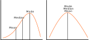
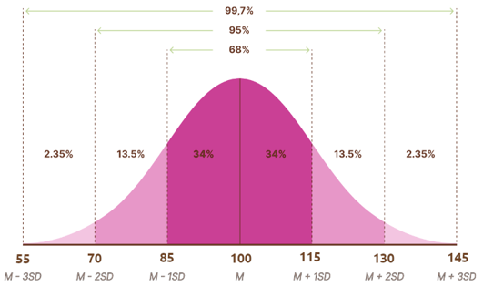
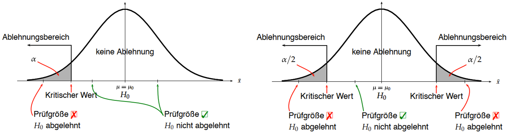
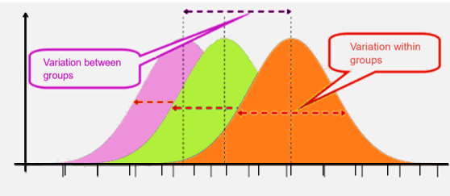
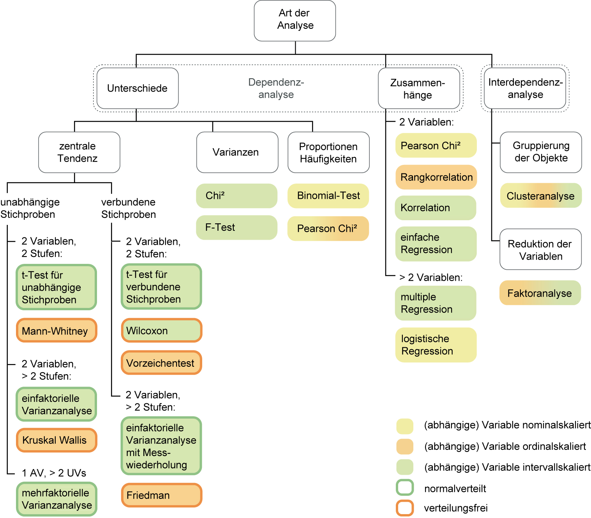
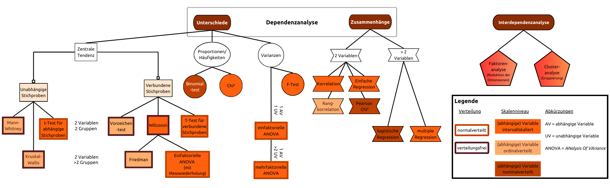

## Univariat - eine Variable

<!-- Color palette choices: https://jmsallan.netlify.app/blog/the-brewer-palettes/ -->


### Modus

Bei Daten, die mindestens nominalskaliert sind (also kategorial), kann man den Modus berechnen.
Der Modus als Maß der zentralen Tendenz ist der Wert, den die Variable am häufigsten annimmt (z.B. das lokale Maximum einer Normalverteilung).

Der Modus wird, im Gegensatz zum Mittelwert (bei metrischen Daten), nicht durch extreme Werte bzw. Ausreißer verzerrt [@kaliyadan2019].

<!-- comment.an.mich:3Bilder von skewed distr. raussuchen, wo man Einfluss auf mode,median,mean sieht -->

### Median

Bei Daten, die mindestens ordinalskaliert (kategorial mit Reihenfolge) sind, kann man den Median berechnen.
Der Median als Maß der zentralen Tendenz ist die Stelle der Verteilung, über bzw. unter der je 50% der Daten liegen.

Der Median wird, im Gegensatz zum Mittelwert, nicht durch extreme Werte bzw. Ausreißer verzerrt [@crump2018].

### Mittelwert

Bei Daten, die mindestens intervallskaliert sind (also metrisch), kann man den Mittelwert (Durchschnitt) berechnen.
Der Mittelwert als Maß der zentralen Tendenz ist die Summe aller Werte, die die Variable angenommen hat, geteilt durch die Anzahl dieser Werte.

Achtung: Der Mittelwert wird durch extreme Werte  bzw. Ausreißer verzerrt. 
Bei sehr asymmetrischen Verteilungen ist ggf. der Median ein besseres Maß der zentralen Tendenz [@crump2018].

```{r echo = F, out.width='60%'}

```

### Standardabweichung

Die Standardabweichung ist ein Streuungsmaß, gibt also an, wie stark die Daten um den Mittelwert streuen. Je verschiedener die Werte sind, desto größer die Standardabweichung.
Sie ist die Wurzel aus der Varianz einer Variablen und benötigt somit das gleiche Skalenniveau wie der Mittelwert.

Innerhalb der ersten Standardabweichungen über und unter dem Mittelwert einer Normalverteilung liegen ca. 68% der Daten.
Innerhalb der ersten zwei Standardabweichungen über und unter dem Mittelwert einer Normalverteilung liegen mehr als 95% der Daten.

<!-- comment.an.mich: NormalVT; Binomial;X^2 etc. einfügen? -->

<!-- # ```{r echo = F, out.width='50%'} -->
<!-- #  -->
<!-- # ``` -->

```{r  echo = F, warning = F, out.width='60%', fig.height=3}
library(ggridges)
library(ggplot2)

normal <- data.frame(x = rnorm(10000, mean = 100, sd = 15),
                     dummy = 1)
                      
ggplot(normal, aes(x = x, y = dummy, fill = factor(stat(quantile)))) +
  stat_density_ridges(
    geom = "density_ridges_gradient",
    calc_ecdf = TRUE,
    quantiles = c(0.0235, 0.1585, 0.8385, 0.9735), # quantiles = c(0.0235, 0.1585, 0.4985, 0.8385, 0.9735, 0.997)
    bandwidth = 2.1,
    color = "white"
  ) +
  # geom_vline(xintercept = seq(70, 130, 15), color = "#7f2704") + 
  scale_fill_manual(values = c("#FDD0A2", "#fd8d3c", "#e95420", "#fd8d3c", "#FDD0A2")) +
  scale_x_continuous(breaks = seq(55,145, 15),
                   lim = c(55, 145),
                   labels = c("M-3sd", "M-2sd","M-1sd", "M", "M+1sd", "M+2sd", "M+3sd")) +
  theme_minimal() +
  theme(legend.position = "none",
        axis.title.x = element_blank(),
        axis.title.y = element_blank(),
        axis.text.y = element_blank(),
        text = element_text(family="Ubuntu", size = 14, color = 'gray15'))

```


## Multivariat - mehrere Variablen

### t-Test

<!-- Allgemein vergleichen t-Tests die Mittelwerte zweier Gruppen mithilfe einer t-verteilten Statistik. -->
<!-- Man hat also zwei mindestens intervallskalierte Variablen, die man miteinander vergleichen möchte. -->
Allgemein vergleicht der t-Test Mittelwerte mithilfe einer t-verteilten Statistik, es handelt sich also um einen parametrischen Test.
Je nach Datenlage und Fragestellung kann man eine Stichprobe gegen einen Referenzwert testen, oder aber zwei Stichproben(-mittelwerte) gegeneinander.
Man hat also zwei mindestens intervallskalierte Variablen, die man miteinander vergleichen möchte.
Bei einer gerichteten Hypothese erfolgt die Testung einseitig, bei einer ungerichteten Hypotheses testet man zweiseitig.
Ist man sich nicht sicher über die Richtung des erwarteten Effekts, lohnt es sich, zweiseitig zu testen.
In theoretisch gut begründeten kann man auch einseitig testen; dies erhöht die Wahrscheinlichkeit, einen Effekt aufzudecken.

Annahmen des t-Tests:

- ausreichend große Stichprobe (Faustregel n=30)
- normalverteilte Daten

Sind die Annahmen verletzt, kann man auf nicht-parametrische Alternativen des jeweiligen t-Tests ausweichen [@crump2018]. 

```{r echo = F, out.width='70%'}

```

#### one-sample t-Test

Der one-sample t-Test vergleicht einen Stichprobenmittelwert mit einem geschätzten oder festgelegten Populationsmittelwert, um zu schauen, ob die Stichprobe mit ausreichender Wahrscheinlichkeit aus dieser Population stammt oder aus einer anderen. 
Dazu braucht man Mittelwert und Standardabweichung der Stichprobe und der Population und den Standardfehler der Mittelwertsverteilung. 
Da so gut wie immer die Statistiken der Population unbekannt sind, muss man diese schätzen.

Ist der t-Test signifikant, gibt es eine Abweichung zwischen der Stichprobe und der Population, die mit ausreichend großer Wahrscheinlichkeit nicht zufällig zustandegekommen ist. 
Ist er nicht signifikant, geht man davon aus, dass die Stichprobe aus der Population stammt.

Nicht-parametrische Alternative: Wilcoxon Signed-Rank Test

#### paired-sample t-Test

Der paired-sample t-Test ist dem one-sample t-Test sehr ähnlich. 
Er wird häufig für within-subjects Experimente genutzt (z.B. die Gedächtnisleistung einer Person vor einem Training wird mit ihrer Leistung nach einem Training verglichen) oder wenn Versuchpersonen aus zwei Gruppen miteinander verbunden sind (z.B. Zwillinge, Paare etc.).
Die Berechnung ist ähnlich wie beim one-sample t-Test. [@crump2018]

Nicht-parametrische Alternative: Wilcoxon Signed-Rank Test (wenn die Differenzen nicht normalverteilt sind; Variable darf ordinalskaliert sein)

#### two-sample t-Test

Der two-sample t-Test (auch independent-sample t-Test) wird für between-subjects Experimente (z.B. der Mittelwertsvergleich zweier Gruppen, die verschiedene Treatments bekamen) genutzt [@crump2018].

Nicht-parametrische Alternative:

- Welch-Test (wenn die Annahme der Varianzhomogenität der beiden unabhängigen Gruppen verletzt ist);
- Mann-Whitney U-Test (wenn die Annahme der Normalverteilung verletzt ist; Variable darf ordinalskaliert sein)

### ANOVA

Eine Varianzanalyse (ANOVA) ähnelt strukturell den t-Tests.
Die F-Statistik, die bei einer ANOVA verwendet wird, ist eine quadrierte t-Statistik.
Man nutzt Varianzanalysen, um herauszufinden, ob gefundene Mittelwertsunterschiede zwischen mehr als zwei Gruppen überzufällig sind oder nur durch Messfehler zustande kamen.
<!-- Im Gegensatz zu den t-Tests, kann man mit einer ANOVA mehr als zwei Gruppen miteinander vergleichen. -->
Das ist hilfreich, wenn es z.B. mehr als nur zwei Experimentalbedingungen gab, die miteinander verglichen werden sollen.
Einfach mehrere t-Tests zu berechnen würde die Wahrscheinlichkeit eines Alpha-Fehlers erhöhen und ist daher keine sinnvolle Alternative.
Die Wahrscheinlichkeit, mind. ein signifikantes Testergebnis zu erhalten, steigt mit der Anzahl der Paarvergleiche um _1 - (1 - alpha)^Anzahl Paarvergleiche_ [@janczyk2015].
Bei vier Gruppen (=sechs Paarvergleiche) wäre die Wahrscheinlichkeit eines falsch-positiven Ergebnisses also nicht mehr 5%, sondern schon 1-(1-0.05)^6 = 26,5%!

Annahmen der ANOVA:

- intervallskalierte Daten
- unabhängige und zufällige Ziehung von k Stichproben
- gleiche Größe der k Stichproben (oder Normalverteilung der Daten und Varianzhomogenität der k samples müssen gelten)[@crump2018]

```{r echo = F, out.width='70%'}

```

#### One-factor ANOVA

Eine einfaktorielle ANOVA benutzt man, wenn man eine unabhängige Variable (UV; Faktor) mit mindestens zwei (sinnvollerweise mindestens drei, sonst ginge auch ein t-Test) Faktorstufen hat. 
Man vergleicht dann im Prinzip auch die Mittelwerte der Faktorstufen miteinander, geht aber einen "Umweg" über die Varianzen. 
Die Versuchspersonen der einzelnen Faktorstufen sind dabei unkorreliert, wie beim independent-samples t-Test.
Die resultierende F-Statistik ergibt das Verhältnis aus erklärbarer Varianz durch die experimentelle Manipulation und der Fehlervarianz.

Mit einer ANOVA kann man nur herausfinden, ob mindestens eine Faktorstufe sich signifikant von mindestens einer weiteren unterscheidet.
Um herauszufinden, welche Faktorstufen sich unterscheiden, muss man post-hoc Tests durchführen.
Man kann nur Haupteffekte finden, da es nur einen Faktor gibt. Um mögliche Interaktionen aufzudecken, braucht man Daten von mindestens zwei unabhängigen Variablen. [@crump2018]

Gängige post-hoc Tests (Auswahl):

- Tukey HSD Test
- Least Significant Difference (LSD)
- Bonferroni

#### Repeated-measures ANOVA

Eine repeated-measures ANOVA nutzt man für within-subjects Designs.
Man hat eine unabhängige Variable (UV; Faktor) mit mindestens zwei bzw. drei Faktorstufen.
Im Gegensatz zur one-factor ANOVA sind aber die Versuchspersonen nicht unabhängig voneinander, sondern man erhebt z.B. Daten derselben Personen zu drei Messzeitpunkten und vergleicht dann sinngemäß jede Person mit sich selbst zu verschiedenen Zeitpunkten. Nach wie vor werden aber nur Daten einer unabhängigen Variable erhoben, weshalb es auch hier nur Haupteffekte geben kann und noch keine Interaktionen.[@crump2018]

#### Factorial ANOVA

Um Interaktionen zweier (oder mehrerer) Faktoren finden zu können, braucht man eine faktorielle ANOVA, d.h. man hat nun mehr als nur eine unabhängige Variable mit mehreren Faktorstufen. 
Beliebte Forschungsdesigns, wie das 2x2 factorial design, können mithilfe einer faktoriellen ANOVA berechnet werden.
Faktorielle ANOVAs erlauben es, Haupteffekte und Interaktionseffekte der Faktoren auf die abhängige Variable zu messen und können sowohl für within- als auch für between-subjects Experimente genutzt werden.[@crump2018]

### Lineare Regression

Bei der linearen Regression möchte man mithilfe einer oder mehrerer unabhängigen Variablen (Prädiktoren) eine abhängige Variable vorhersagen. 
Die unabhängigen Variablen wie auch die abhängigen Variable sind metrisch.
Grafisch dargestellt ist die Regressionsgerade die Linie, die die Daten am besten beschreibt, d.h. zu der die Abstände von jedem Datenpunkt eines Scatterplots aus minimal sind. Diese Abstände zeigen den Messfehler an. 
Gäbe es keinen Messfehler, würden alle Datenpunkte auf der Regressionsgerade liegen [@crump2018; @uzh2023].
<!-- Gäbe es keinen Messfehler, würden alle Datenpunkte auf der Regressionsgerade liegen [@crump2028],[@uzh2023]. -->

```{r echo = F, warnings = F, out.width='60%'}
library(ggplot2)

data <- faux::rnorm_multi(n = 100,
                          mu = c(0, 0.2),
                          sd = c(1, 1.2),
                          r = c(0.7),
                          varnames = c("X", "Y"),
                          empirical = F)

ggplot(data, aes(x = X, y = Y)) +
  geom_jitter() +
  geom_smooth(formula = 'y ~x', method = lm, se = FALSE, color = "#8C2D04") +
  geom_vline(xintercept = mean(data$X), color = "#fd8d3c") +
  geom_hline(yintercept = mean(data$Y), color = "#e95420") +
  theme_minimal() +
  theme(axis.title.x = element_text(color = "#fd8d3c", size = 12),
        axis.title.y = element_text(color = "#e95420", size = 12))
```


### Chi<sup>2</sup>

Der Chi<sup>2</sup> Test (Kontingenzanalyse) gehört zu den nicht-parametrischen Verfahren, es wird also keine Annahme über die Verteilung der zugrundeliegenden Daten gemacht.
Er untersucht den Zusammenhang zweier nominal- bis ordinalskalierter Variablen, die in einer "Kreuztabelle" gegenübergestellt werden, indem beobachtete Häufigkeiten der Daten mit den erwarteten Häufigkeiten verglichen werden (nicht Mittelwerte!, s. t-Tests).
Der Chi<sup>2</sup> Test nutzt die Chi<sup>2</sup> Statistik, ansonsten funktioniert das Signifikanztesten analog zu den bereits genannten Verfahren.
Chi<sup>2</sup> Tests können auf ein- und mehrdimensionale Zusammenhänge angewandt werden.
[@uzh2023; @lowry1998]
<!-- [@uzh2023], [@lowry] -->

### Faktorenanalyse

Faktorenanalysen gehören zu den Interdependenzanalysen. Sie werden genutzt, um Strukturen in den Daten zu entdecken (explorative Faktorenanalyse) oder erwartete Strukturen zu bestätigen (konfirmatorische Faktorenanalyse). Dabei ist das Ziel, hoch korrelierende Variablen zu  übergeordneten Faktoren zusammenzufassen. Gefundene Faktoren sollten möglichst gering mit anderen Faktoren korrelieren.

Für eine Faktorenanalyse braucht man:

- eine ausreichend große Stichprobe
- ausreichend viele Variablen
- intervallskalierte Variablen (Häufig werden dennoch ordinalskalierte Variablen verwendet.)

Bei explorativen Faktorenanalysen (EFA) hat man keine Hypothesen über die Struktur, die geprüft werden soll, wie bei der konfirmatorischen Faktorenanalyse (CFA), die ein strukturüberprüfendes Verfahren darstellt [@uzh2023].


<!-- ## Übersicht der Universität Zürich [@uzh2023] -->

<!-- ```{r echo = F, out.width='50%'} -->
<!--  -->
<!-- ``` -->

## Übersicht der gängigen Statistiken 
### [adaptiert von @uzh2023]

```{r echo = F, out.width='150%', fig.align='center'}

```

## Literatur

<!-- <div id="refs"></div> -->


<!-- ```{css, include = T, echo = F} -->
<!-- THOUGHT THIS WAS NECESSARY; BUT APPARENTLY JUST OBSTRUCTS THE STYLING FROM THE ORIGINAL APP -->
<!-- body { -->
<!--     background-image: url(UniKonstanz_Logo.png); -->
<!--     background-size: 25%; -->
<!--     background-repeat: no-repeat; -->
<!--     background-position: 96% 1%; /* 3% 96%; makes it show up bottom left*/ -->
<!--     font-family: 'Ubuntu'; -->
<!--     color: #333; -->
<!-- } -->

<!-- h1 { -->
<!--     font-family: 'Ubuntu'; -->
<!--     color: #474747; /*this shade is 10% lighter than 333 so nicer for headings probably*/ -->
<!-- } -->
<!-- h2 { -->
<!--     font-family: 'Ubuntu'; -->
<!--     color: #474747; -->
<!-- } -->
<!-- h3 { -->
<!--     font-family: 'Ubuntu'; -->
<!--     color: #474747; -->
<!-- } -->
<!-- h4 { -->
<!--     font-family: 'Ubuntu'; -->
<!--     color: #474747; -->
<!-- } -->
<!-- ``` -->