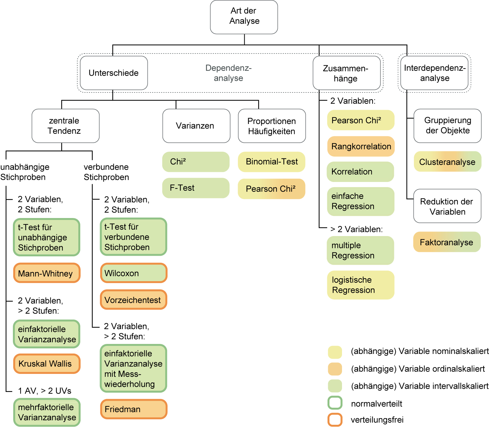

## Univariat - eine Variable


### Modus

### Median

### Mittelwert

### Standardabweichung

## Multivariat - mehrere Variablen

### t-Test

### ANOVA

### Lineare Regression

### Chi<sup>2</sup>

## Übersicht der Universität Zürich [@uzh2023]

```{r echo = F, out.width='70%'}

```


> According to @kaliyadan2019, Statistics are awesome.


## Literatur

<!-- <div id="refs"></div> -->


<!-- ```{css, include = T, echo = F} -->
<!-- THOUGHT THIS WAS NECESSARY; BUT APPARENTLY JUST OBSTRUCTS THE STYLING FROM THE ORIGINAL APP -->
<!-- body { -->
<!--     background-image: url(UniKonstanz_Logo.png); -->
<!--     background-size: 25%; -->
<!--     background-repeat: no-repeat; -->
<!--     background-position: 96% 1%; /* 3% 96%; makes it show up bottom left*/ -->
<!--     font-family: 'Ubuntu'; -->
<!--     color: #333; -->
<!-- } -->

<!-- h1 { -->
<!--     font-family: 'Ubuntu'; -->
<!--     color: #474747; /*this shade is 10% lighter than 333 so nicer for headings probably*/ -->
<!-- } -->
<!-- h2 { -->
<!--     font-family: 'Ubuntu'; -->
<!--     color: #474747; -->
<!-- } -->
<!-- h3 { -->
<!--     font-family: 'Ubuntu'; -->
<!--     color: #474747; -->
<!-- } -->
<!-- h4 { -->
<!--     font-family: 'Ubuntu'; -->
<!--     color: #474747; -->
<!-- } -->
<!-- ``` -->